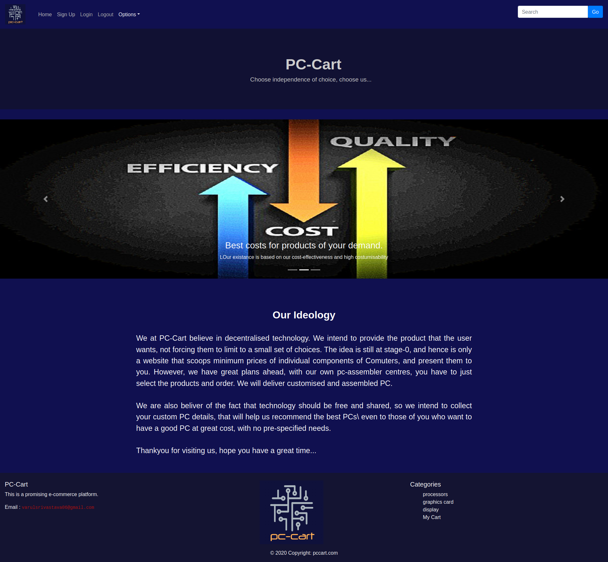
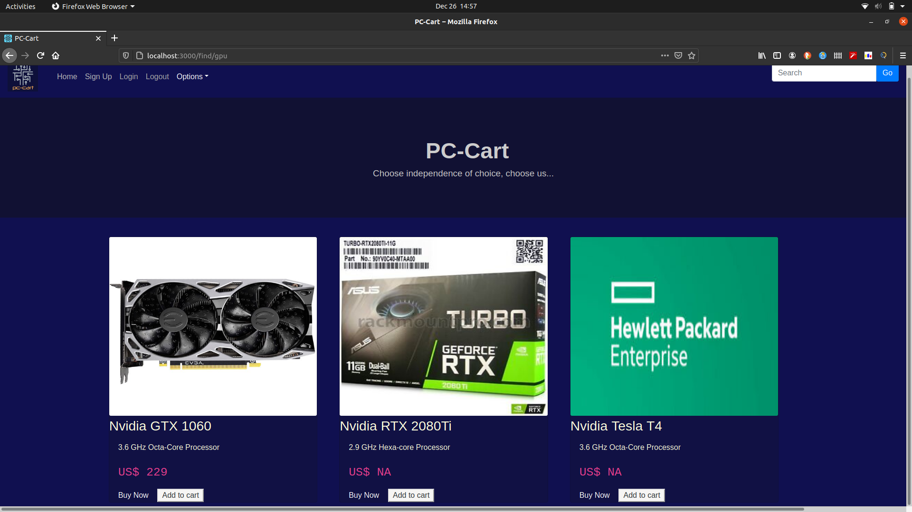
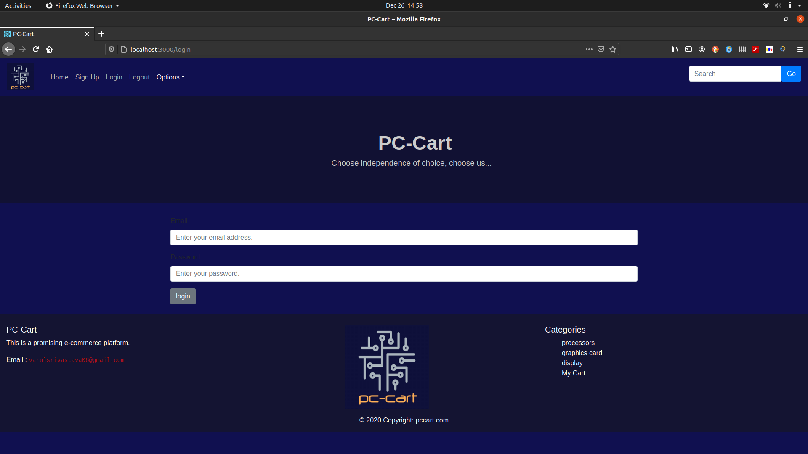

# MyPCShop
This is a Custom PC build web-application as part of the SummerUp 2020 project and further.

## Build Script

Some pre-requisites are : 
1. python3
2. node-js
3. pip3
4. npm/npx


To install all dependencies run

```bash
$ npm install
$ pip3 install beautifulsoup4

```

Running the application

To run the server, run
```
<*/PC-Cart/>$ node server.js
```

The server will launch on the port 5000 of the machine

To run the web application run
```bash
<*/PC-Cart/pccart/>$ npm start
```

## Web Application


The following is the PC-cart homepage

The following are some features that I think are worth mentioning : 
1. In-build search feature for items that are available on the website
2. Create-account, login feature that enables us to save user's current wishlist/cart contents for future sessions.
3. Web-scrapper that extracts prices from different websites for same product and displays them on the web page
4. Good design with seperate frontend, backend and database for easy migration of stack to MERN or other forms, and easy debugging and adding of features.

Some other screenshots of the website
1. The Product lists 
2. The login/signin feature 


## Web-Application

The web application is made using :

1. React-Js
4. React-bootstrap
2. Node-Js 
3. Express
5. Axios for client-server communication


## Web scrapping

The tools used were :

1. Python3
2. beautifulsoup4

